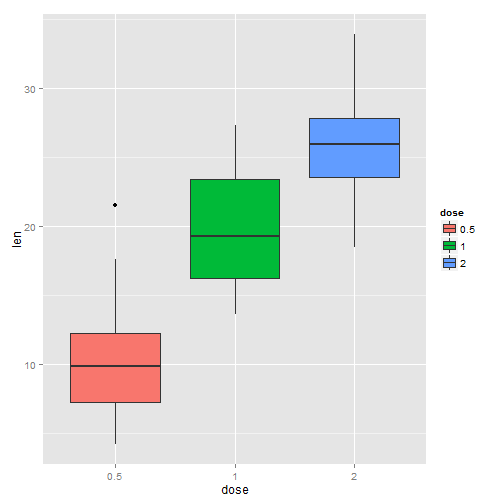
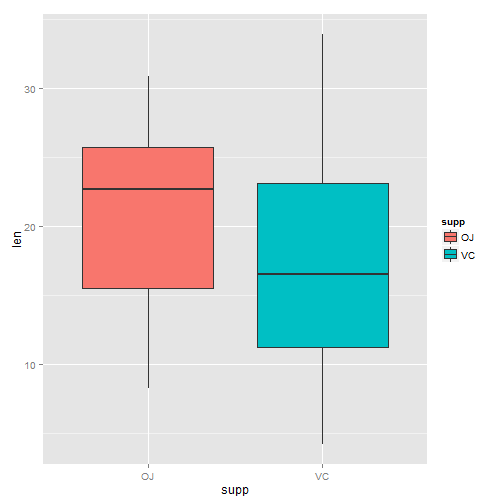

Statistical Inference Course Project - Part 2
Will Zhang

25-12-2015

This report is for second part of the course project of the Coursera course "Statistical Inference" which is a part of specialization "Data Science". In this second part, we perform basic inferential analyses using the ToothGrowth data in the R datasets package.

As per the help file of this dataset, the response is the length of odontoblasts (teeth) in each of 10 guinea pigs at each of three dose levels of Vitamin C (0.5, 1, and 2 mg) with each of two delivery methods (orange juice or ascorbic acid).

Load necessary packages

```r
library(ggplot2)
```

1. Load the ToothGrowth data and perform some basic exploratory data analyses.

```r
# load the dataset
library(datasets)
data(ToothGrowth)

# look at the dataset variables
str(ToothGrowth)
```

```
## 'data.frame':	60 obs. of  3 variables:
##  $ len : num  4.2 11.5 7.3 5.8 6.4 10 11.2 11.2 5.2 7 ...
##  $ supp: Factor w/ 2 levels "OJ","VC": 2 2 2 2 2 2 2 2 2 2 ...
##  $ dose: num  0.5 0.5 0.5 0.5 0.5 0.5 0.5 0.5 0.5 0.5 ...
```


```r
# number of rows of dataset
nrow(ToothGrowth)
```

```
## [1] 60
```


```r
# convert variable dose from numeric to factor
ToothGrowth$dose <- as.factor(ToothGrowth$dose)

# look at the dataset variables after conversion
str(ToothGrowth)
```

```
## 'data.frame':	60 obs. of  3 variables:
##  $ len : num  4.2 11.5 7.3 5.8 6.4 10 11.2 11.2 5.2 7 ...
##  $ supp: Factor w/ 2 levels "OJ","VC": 2 2 2 2 2 2 2 2 2 2 ...
##  $ dose: Factor w/ 3 levels "0.5","1","2": 1 1 1 1 1 1 1 1 1 1 ...
```

2. Provide a basic summary of the data.


```r
# summary statistics for all variables
summary(ToothGrowth)
```

```
##       len        supp     dose   
##  Min.   : 4.20   OJ:30   0.5:20  
##  1st Qu.:13.07   VC:30   1  :20  
##  Median :19.25           2  :20  
##  Mean   :18.81                   
##  3rd Qu.:25.27                   
##  Max.   :33.90
```


```r
# split of cases between different dose levels and delivery methods
table(ToothGrowth$dose, ToothGrowth$supp)
```

```
##      
##       OJ VC
##   0.5 10 10
##   1   10 10
##   2   10 10
```


```r
ggplot(aes(x=dose, y=len), data=ToothGrowth) + geom_boxplot(aes(fill=dose))
```

 


```r
# visualization of tooth growth as function of supplement type
ggplot(aes(x=supp, y=len), data=ToothGrowth) + geom_boxplot(aes(fill=supp))
```

 

3. Use confidence intervals and hypothesis tests to compare tooth growth by supp and dose.


```r
# check for group differences due to different supplement type 
# assuming unequal variances between the two groups
t.test(len ~ supp, data = ToothGrowth)
```

```
## 
## 	Welch Two Sample t-test
## 
## data:  len by supp
## t = 1.9153, df = 55.309, p-value = 0.06063
## alternative hypothesis: true difference in means is not equal to 0
## 95 percent confidence interval:
##  -0.1710156  7.5710156
## sample estimates:
## mean in group OJ mean in group VC 
##         20.66333         16.96333
```

The p-value is 0.06, and the confidence interval contains zero. This indicates that we can not reject the null hypothesis that the different supplement types have no effect on tooth length.


```r
# first create three sub-groups as per dose level pairs
ToothGrowth.doses_0.5_1.0 <- subset (ToothGrowth, dose %in% c(0.5, 1.0)) 
ToothGrowth.doses_0.5_2.0 <- subset (ToothGrowth, dose %in% c(0.5, 2.0)) 
ToothGrowth.doses_1.0_2.0 <- subset (ToothGrowth, dose %in% c(1.0, 2.0)) 

# Check for group differences due to different dose levels (0.5, 1.0)
# assuming unequal variances between the two groups
t.test(len ~ dose, data = ToothGrowth.doses_0.5_1.0)
```

```
## 
## 	Welch Two Sample t-test
## 
## data:  len by dose
## t = -6.4766, df = 37.986, p-value = 1.268e-07
## alternative hypothesis: true difference in means is not equal to 0
## 95 percent confidence interval:
##  -11.983781  -6.276219
## sample estimates:
## mean in group 0.5   mean in group 1 
##            10.605            19.735
```


```r
# Check for group differences due to different dose levels (0.5, 2.0)
# assuming unequal variances between the two groups
t.test(len ~ dose, data = ToothGrowth.doses_0.5_2.0)
```

```
## 
## 	Welch Two Sample t-test
## 
## data:  len by dose
## t = -11.799, df = 36.883, p-value = 4.398e-14
## alternative hypothesis: true difference in means is not equal to 0
## 95 percent confidence interval:
##  -18.15617 -12.83383
## sample estimates:
## mean in group 0.5   mean in group 2 
##            10.605            26.100
```


```r
# Check for group differences due to different dose levels (1.0, 2.0)
# assuming unequal variances between the two groups
t.test(len ~ dose, data = ToothGrowth.doses_1.0_2.0)
```

```
## 
## 	Welch Two Sample t-test
## 
## data:  len by dose
## t = -4.9005, df = 37.101, p-value = 1.906e-05
## alternative hypothesis: true difference in means is not equal to 0
## 95 percent confidence interval:
##  -8.996481 -3.733519
## sample estimates:
## mean in group 1 mean in group 2 
##          19.735          26.100
```

For all three dose level pairs, the p-value is less than 0.05, and the confidence interval does not contain zero. The mean tooth length increases on raising the dose level. This indicates that we can reject the null hypothesis, and establish that increasing the dose level leads to an increase in tooth length.

4. State your conclusions and the assumptions needed for your conclusions.

Conclusions

Supplement type has no effect on tooth growth.
Inreasing the dose level leads to increased tooth growth.
Assumptions

The experiment was done with random assignment of guinea pigs to different dose level categories and supplement type to control for confounders that might affect the outcome.
Members of the sample population, i.e. the 60 guinea pigs, are representative of the entire population of guinea pigs. This assumption allows us to generalize the results.
For the t-tests, the variances are assumed to be different for the two groups being compared. This assumption is less stronger than the case in which the variances are assumed to be equal.
